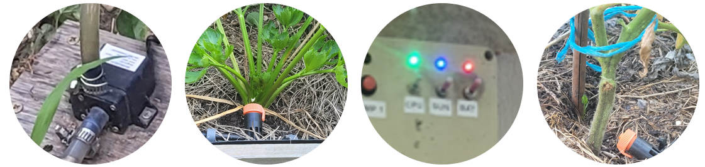
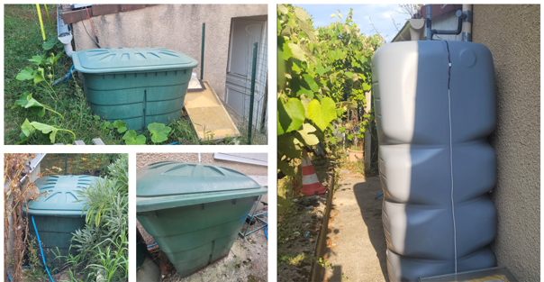
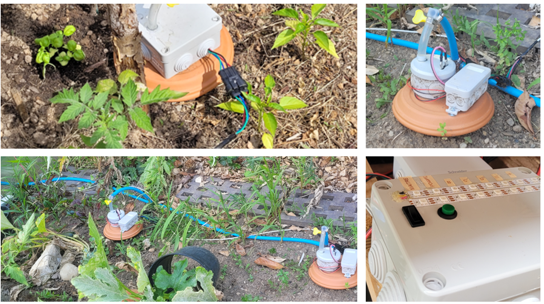

# Jarduino

Le Jarduino est un ensemble de systèmes pour l'arrosage du jardin.

Il comporte les sous-ensembles suivants:
- Gestion des goutteurs
- Gestion des cuves
- Gestion des oyas

Le principal objectif du projet est de s'amuser tout en mettant à profit les compétences acquises lors d'une réponse à un cahier des charges pour un projet professionnel qui n'a finalement pas abouti.

La réalisation inclue des cartes électroniques conçues sur mesure, du logiciel, quelques petites pièces mécaniques et bien d'autres éléments....

## Illustrations (photos)

## Gestion des goutteurs

### Aux origines...

Le système de goutteurs est le "Jarduino" historique, mis en place assez rapidement (en 2019 ?) pour partir en vacances sans s'occuper de l'arrosage.

Il a fonctionné presque jusqu'au bout. Le panneau solaire s'est retourné (vent?), et sans énergie, il s'est arrêté...

Depuis 2019, chaque année, le Jarduino fonctionne toujours en se perfectionnant. Il a compté jusqu'à une cinquantaine de goutteurs en 2022.

### Jarduino 2

Ce Jarduino est un peu plus sérieux, basé sur de vraies cartes électroniques et non plus sur des platines de prototypage.

Il a été prévu en deux étapes:
- Tout d'abord une version simple basée sur un arduino Nano et une RTC;
- ensuite, une connexion Wifi via un ESP01 et la liaison série / modbus.

Il a fonctionné sans difficultés. Mais le module Wifi n'est toujours pas prêt (en 2024)...

#### Principe

Une cuve permet de stoker de l'eau. Un boîtier de contrôle alimenté par un panneau solaire avec une batterie pilote une pompe qui allimente les goutteurs.
Le boîtier pilote jusqu'à deux pompes et peut être programmé à une heure donnée pour une durée d'arrosage souhaitée.

Voir ici la description détaillée: [Système de goutteurs](./goutteurs)

## Gestion des cuves

Plusieurs cuves récupèrent l'eau de pluie et permettent d'approvisioner les systèmes d'arrosage automatiques.
Un système de pompes contrôlables à distance permet de gérer leur niveau.

Voir ici la description détaillée: [Gestion des cuves](./cuves)

## Gestion des OYAs

Le système permet de diffuser de l'eau aux plantes par la terre grâce à des sortes de petites jarres en argile appellées OYAs.
Ce dispositif a été déployé après les goutteurs, en 2023. Il remplace petit à petit le système de goutteurs.

Voir ici la description détaillée: [Gestion des OYAs](./oyas)

