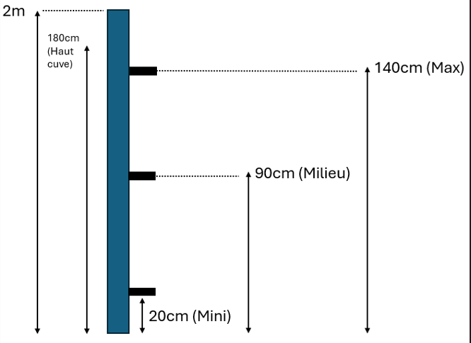
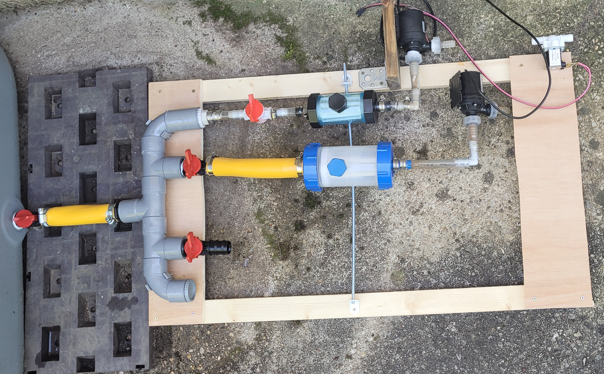

# Cuves

Nous avons 4 cuves pour une capacité totale de 1600 L.

- Cuve principale de 1000 L
- cuve  "Paul" de 100 L (pour gouteurs petits bacs)
- cuve "Réduit" de 250 L pour les OYAs
- cuve "Barbec" de 250 L pour les OYAs

Deux cuves de 250 alimentent nos deux systèmes de remplissage automatique des OYAs.

Les cuves sont communicantes et un système permet de pomper l'eau de la cuve principale vers les autres. 

## Description des cuves

### Cuve principale (Main)

Cette cuve recueille l'eau du toit de la maison. D'une capacité de 1000 L, elle constitue la réserve principale.
Elle sert à alimenter la cuve "Paul" et aussi la cuve "Réduit" en cas de besoin.

Comme on peut le voir sur la troisième photo, une colonne PVC de 32mm est utilisée comme jauge de niveau.
Cette solution permet d'éviter de percer des trous dans la paroi de la cuve (comme pour les autres).

Trois capteurs à flotteur sont fixés sur cette colonne qui ensuite est remplie de résine pour rendre le tout étanche et durable:

A la base de la cuve, un système de 2 pompes (précédées de filtres) permet de déplacer l'eau vers les autres cuves (Paul et Réduit):

Le modèle de pompe utilisé est le AW500S 12V 5m 800L/H:

Pour la petite histoire, nous disposions avant 2023 à cet emplacement d'une cuve de moindre contenance.
Mal positionnée sur son support, un jour de pluie elle est tombée de tout son poids et BOOM !

Depuis, elle marche moins bien...

### Cuve Paul

La cuve "Paul" (de Paul) de 100 L permet d'alimenter un système de gouteurs pour des bacs de jardinage (5 bacs en 2024).

La détection de niveau est réalisée à l'aide de 3 capteurs avec flotteur montés sur la paroi de la cuve.

### Cuve Réduit

Cette cuve de 250 L alimente un système de remplisage d'OYAs et permet également d'alimenter la cuve Barbecue si besoin.

La détection de niveau est réalisée à l'aide de 3 capteurs avec flotteur montés sur la paroi de la cuve. 

Le système de capteurs a montré ses limites car des fuites sont apparus au bout d'un an d'utilisation au niveau de ces capteurs.
Pour pallier au problème, de la résine a été utilisée pour recouvrir la zone sensible autour des capteurs.

### Cuve Barbecue

Cette cuve de 250 L alimente un système de remplisage d'OYAs et un système de gouteurs.
La détection de niveau est réalisée à l'aide de 3 capteurs avec flotteur montés sur la paroi de la cuve. 

## Filtres imprimés en 3D

### Filtre intérieur

### Filtre sortie vers tuyau 8mm

## Modules Wifi pour commander les pompes

### Description

Le module de pompage comporte:
- 1 alimentation 12V;
- 1 sortie pompe de 12V/5A;
- 3 entrées de type interrupteur (actif à l'état bas) pour la détection du niveau de cuve.

### Carte Wifi IO

### Protocole d'échange avec MQTT

## Serveur de contrôle

Le serveur comporte un broker MQTT pour centraliser les connexions des différents modules du système.

Un serveur reddis stocke tous les états, les réglages et les commandes des différentes applications.

Les applications sont les suivantes:
- Interraction avec les modules de pompage
- Publication des états sur les écrans
- Webservice pour exposer les services à des clients
- Automatisme de contrôle
- Logger

## Module d'affichage

Le module d'affichage comporte un écran, OLED.

Il permet de visualiser l'état des cuves et l'activité de pompage en temps réel.

