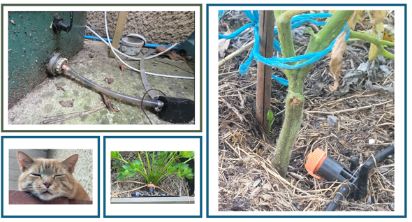
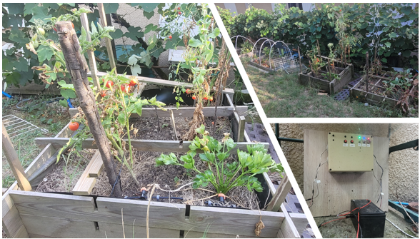
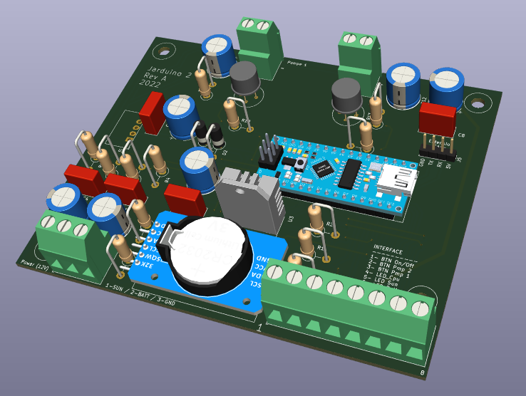
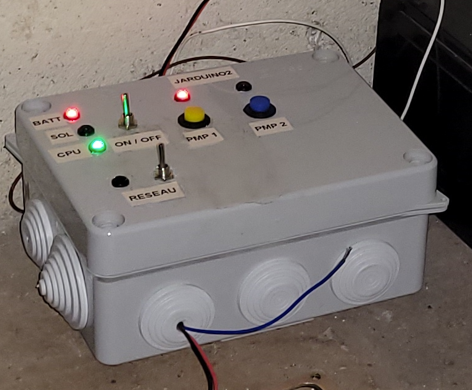
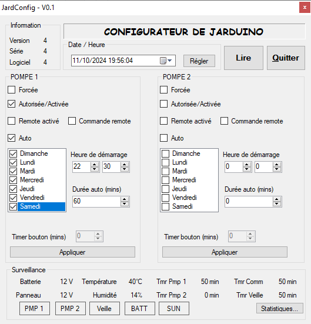

# Goutteurs (Jarduino2)

Jarduino2 est une évolution du premier jarduino fabriqué en 2019.

Le premier jarduino était construit avec des platines de prototypage et un arduino MKR Zero Wifi.

Ce nouveau jarduino est construit à partir d'un Nano. On peut le configurer à l'aide d'une interface MODBUS sur l'USB ou bien sur le port série d'extension.
Il est possible de lui ajouter une extension Wifi pour le relier au réseau.

## Vue d'ensemble

Deux systèmes jarduinos étaient actifs en 2024, couvrant deux zones de jardin.
Chaque système est alimenté par une cuve à l'aide d'une pompe ou deux pompes.

Un coffret de commande permet de mettre ou non en service le système et de déclencher un arrosage en mode manuel.

Chaque coffret peut se programmer à l'aide d'un logiciel PC connecté à l'USB de la carte de commande. Cela permet d'activer ou non le mode automatique et de choisir l'heure de déclenchement et la durée d'arrosage.

Le coffret dispose de deux sorties pouvant commander deux pompes. Chaque voie peut alimenter jusqu'à 20 goutteurs. 

## Hardware

### Caractéristiques

  - Alimentation 12V;
  - Entrée de mesure de tension de panneau solaire;
  - 2 sorties 5W pour pompe (De type aquarium);
  - Sonde de température/Humidité;
  - LEDs et interrupteurs.

### Schéma

[Schéma de la carte de commande](./hard/jarduino2_nano/jarduino2_nano.pdf)

[Schéma de la carte d'interface à LEDs](./hard/jarduino2_ihm/jarduino2_ihm.pdf)

### PCBs

Chaque boîtier/coffret de commande est composé de deux circuits imprimés (PCBs):
- La carte de commande contient le microcontrôleur et gère tout le système
- la carte d'interface permet à l'utilisateur visualiser le fonctionnement et d'agir sur celui-ci.

### Boîtier de commande

| LED | Description |
| --- | --- |
| BATT | Batterie OK |
| SUN | Panneau photovoltaique OK |
| Réseau | Réseau Wifi Activé |

NB: Il n'y a pas à ce jour (en 2024) de module Wifi terminé et apte à se connecter au réseau de domotique de la maison. C'est une fonction prévue à l'origine mais qui ne verra peut-être pas le jour puisque nous sommes en train de remplacer les goutteurs par des OYAs.

| Bouton | Type | Description |
| --- | --- | --- |
| ON/OFF | Inverseur  | Bouton de mise en service (Ne coupe pas l'alimentation mais fait passer le CPU en veille) |
| Réseau | Inverseur  | Bouton de mise sous tension de la carte Wifi (si présente) |
| Pump 1 | Poussoir  | Bouton de démarrage de l'arrosage manuel de la voie 1 |
| Pump 2 | Poussoir  | Bouton de démarrage de l'arrosage manuel de la voie 2 |

Le boîtier comporte les entrées/sorties suivantes:

| Voie | Type | Description |
| --- | --- | --- |
| Alimentation | Alim 12V  | Connection d'une batterie extérieure (Plomb) |
| solaire | Alim 12V/20V | Connection d'un panneau solaire pour recharger la batterie |
| Pompe 1 | Sortie 12V | Sortie de commande de la pompe 1 |
| Pompe 2 | Sortie 12V | Sortie de commande de la pompe 2 |

NB: Un module chargeur/régulateur solaire se trouve dans le boîtier pour permettre la charge de la batterie à l'aide du panneau solaire relié.

Ce système s'est avéré suffisant pour gérer le décalage entre les horaires à forte énergie solaire (jour) et la plage horaire idéale pour arroser (soirée/début de nuit).

## Logiciels

### Logiciel embarqué dans la carte de commande

[Logiciel gestion des goutteurs](./src)

### Logiciel PC pour configurer le système

Ce logiciel permet de configurer le boîtier Jarduino.
Pour cela, on branche un PC à l'USB de la carte de commande.

On peut:
- Régler l'heure

Et pour chaque voie (1 ou 2):
- Forcer la commande de la pompe
- Activer ou désactiver la pompe
- Activer et simuler le pilotage distant de la pompe
- Sélectionner le mode Auto (basé sur l'horloge)
- Régler l'heure d'arosage automatique
- Régler la durée de l'arrosage automatique
- Sélectionner les jours de semaine de l'arrosage automatique

Il permet également d'afficher l'état du système et quelques statistiques de fonctionnement.

Le logiciel communique avec le boîtier Jarduino à l'aide du protocole MODBUS (Voir ci-après).

## Protocole MODBUS

Le jarduino implémente un serveur/esclave MODBUS.

Seules les functions suivantes sont implémentées:

- 01 READ COIL STATUS
- 02 READ INPUT STATUS
- 03 READ HOLDING REGISTERS
- 04 READ INPUT REGISTERS
- 15 WRITE MULTIPLE COILS
- 16 WRITE MULTIPLE REGISTERS

### Table des COILs (Lecture/Ecriture)

Adresse | Description
--- | ---
10 | Forçage POMPE 1
11 | Autorisation/Activation POMPE 1
12 | Mode automatique POMPE 1
13 | Mode Distant POMPE 1
14 | Commande distante POMPE 1
--- | ---
20 | Forçage POMPE 2
21 | Autorisation/Activation POMPE 2
22 | Mode automatique POMPE 2
23 | Mode Distant POMPE 2
24 | Commande distante POMPE 2

Ces bits sont enregistrés en EEPROM sauf ceux qui correspondent au forçage des pompes et à leur commande distante.

NB: La commande à distance des pompe est appliquée seulement si le maître modbus communique toujours avec le jarduino nano.

### Table des Entrees (Lecture)

Adresse | Description
--- | ---
0 | Etat LED pompe 1
1 | Etat LED pompe 2
2 | Tension battery OK
3 | Tension panneau solaire OK
4 | Est en mode veille

### Table des INPUT REGISTERs (Lecture)

Adresse | Description
--- | ---
0 | Niveau de batterie en dxV
1 | Niveau du panneau solaire en dxV
2 | Temperature en °C
3 | Humidité en %
4 | Temps restant avant détection Comm perdue (en ms)
5 | Temps restant avant veille (en ms)
--- | ---
10 | Temps restant timer de pompe 1 (en min)
--- | ---
20 | Temps restant timer de pompe 2 (en min)
--- | ---
100 | Nombre total de boots
101 | Temps de fonctionnement total POMPE 1 (en H)
102 | Temps de fonctionnement total POMPE 1 (en H)
103 | Temps total d'ensoleillement (en H)
104 | Nombre total de pressions sur le bouton POMPE 1
104 | Nombre total de pressions sur le bouton POMPE 2
--- | ---
200 | Version (2 pour jarduino 2)
201 | Numéro de série du Jarduino
202 | Version du logiciel nano

### Table des HOLDING REGISTERs (Lecture/Ecriture)

Adresse | Description
--- | ---
0 | Année
1 | Mois
2 | Jour
3 | Heure
4 | Minute
5 | Seconde
--- | ---
10 | Heure de démarrage POMPE 1
11 | Minute de démarrage POMPE 1
12 | Durée (en min) d'activation de la POMPE 1
13 | Jours de la semaine pour l'activation de la POMPE 1 (Bit 0: Dimanche, Bit 1: Lundi, ..., Bit 7: Samedi)
14 | Réglage du délai du timer de pompe 1 (en min)
--- | ---
20 | Heure de démarrage POMPE 2
21 | Minute de démarrage POMPE 2
22 | Durée (en min) d'activation de la POMPE 2
23 | Jours de la semaine pour l'activation de la POMPE 2 (Bit 0: Dimanche, Bit 1: Lundi, ..., Bit 7: Samedi)
24 | Réglage du délai du timer de pompe 2 (en min)