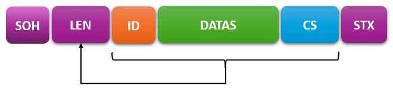

# Protocole

Ce protocole est commun à toutes les cartes esclaves.
Le réseau comporte un maître et plusieurs esclaves. 

## Couche physique

Il est basé sur du RS485 à 9600 bauds sans parité.

Le maître comporte une terminaison de 120 Ohms et 2 résistances de polarisation de A/B.

## Adressage

Une adresse comprise entre 1 et 14 est affectée à chaque esclave. Chaque adresse doit être unique sur son réseau.

Salon la version de la carte, cette adresse est soit configurable à l'aide d'un switch rotatif à 16 positions, soit mémorisée dans l'EEPROM du micro.

Les positions 0 et 15 sont réservées:
- 0: Désactiver l'esclave (il ne répond plus);
- 15: Prendre la valeur d'adresse configurée en EEPROM.

Pour les modèles sans commutateur, il faut écrire la valeur en EEPROM (Voir les #define du programme associé pour injecter un programme de configuration).

L'adresse 1 est exclusivement réservée à la pompe et il ne peut y avoir qu'une seule pompe sur un réseau.

Le maître n'a pas d'adresse.

## Principe

Seul le maître peut initier une communication. Un seul esclave peut répondre à une trame émise par le maître.

Types de messages du maître:

- Trame Commandes
- Trame Ping
- Trame Sync
- Trame de Raz du temps de fonctionnement
- Trame de Raz du nombre d'erreurs

Types de réponses d'un esclave:

- Trame Pompe
- Trame Oya
- Trame Pong

La communication se fait par cycles. Chaque cycle se termine par une trame Sync.

Durant un cycle, le maître envoie autant de trames __*"Commandes"*__ qu'il y'a d'esclaves configurés. Chaque trame __*"Commandes"*__ comporte un appel destiné à un esclave en particulier. Seul l'esclave appelé peut répondre avec l'une des deux trames __*"Oya"*__ ou __*"Pompe"*__.

Après un __*"Sync"*__, le maître doit impérativement attendre un temps minimum avant d'initier un nouveau cycle. Cela permet aux esclaves d'effectuer des traitements.
Cette technique permet d'éviter qu'une éventuelle surcharge de cpu d'un esclave ne vienne perturber le cycle réseau.

Certaines trames du maître ne doivent pas induire de réponse (Trames Raz et Sync par exemple).

### Format d'une trame

Toute trame doit avoir le format suivant:

Elément | Taille | Description | exemple(s)
--- | --- | ---
SOH | 1 | Valeur 1 (Voir table ASCII) | 
LEN | 2 | Taille de la trame comprenant Length + ID msg + datas + Checksum (1 octet codé en chaîne hexadécimale) | '09' = 9 octets
ID | 1 | Identifiant (ou type) de trame(1 caractère) | 'm' = Trame de commande du maître, 'o' = Réponse d'un oya...
DATA | n=2p | Données propres au type de trame (n octets codés en chaîne hexadécimale) |  Voir chaque type de trame
CS | 2 | Somme de contrôle (1 octet codé en chaîne hexadécimale) | 'AE' = 174
STX | 1 | Valeur 2 (Voir table ASCII) |

Chaque chaine hexadécimale est codée selon la logique du MSB first. C'est à dire que l'on envoi l'octet de poids fort en premier.
Exemple le mot 16 bits 0xABCD sera transcrit 'ABCD' dans la trame

### Liste des types de trames

ID | Maître | Esclave | Description
--- | --- | --- | ---
m | X | | Trame de commande générale envoyée par le maître
p | | X | Trame de réponse envoyée par un esclave de type pompe lorsque son adresse est contenue dans la trame de commande générale
o | | X | Trame de réponse pour un oya (même principe que pour la trame p)
S | X | | Trame SYNC de synchronisation fin de cycle
i | X | | Trame PING envoyé par le maître pour tester un esclave en particulier
y | | X | Trame PONG de réponse d'un esclave à un PING
t | X | | Trame de RAZ du temps destinée à un esclave
z | X | | Trame de RAZ du nombre d'erreurs destinée à un esclave

### Description détaillée des types de trames

#### Principes communs à toutes les trames

#### Trame de commande générale (m)

[SOH]09m{Commandes}{Adresse}{Checksum}[STX]

Elément | Description | exemple(s)
--- | --- | ---
Commandes | 16 bits B15..B0 codés en chaîne hexadécimale | '0802' = Pompe (@1) et oya (@11) actifs
Adresse| Adresse du noeud concerné par la réponse | '0E' = esclave 14, '01' = pompe, ...

B1 correspond à la pompe (activée si à 1)
B2..B14 correspondent aux Oyas @2 à @14 (activés si à 1)

NB: B0 et B15 sont réservés et aucun esclave ne doit interpréter ces commandes.

Les adresses sont comprises entre 1 et 14. Aucun esclave ne doit répondre à des sollicitations pour les adresses en dehors de cet intervalle.

Lorsque le maître envoi cette trame, il attend une réponse de la part de l'esclave concerné. En cas d'absence de réponse de l'esclave, celui-ci est considéré comme non connecté.

#### Trames de réponse d'un esclave (p,o)

Les trames de réponse d'un Oya et d'une pompe sont très similaires.
La différence réside dans l'interprétation de l'octet de statut et par la présence du débit pour la pompe.

[SOH]XXp{Statut}{tick}{temp}{hum}{volt}{total time}{total errs}{flow}{Checksum}[STX]

Elément | Description | exemple(s)
--- | --- | ---
Statut | 1 octet de statut B7..B0 codés en chaîne hexadécimale | '02' = 
tick |  | 

### Description détaillée des échanges

#### Echange Commande/Réponse

#### Echange Ping/Pong

### Description d'un cycle

#define STATUS_CMD     		(0x01)
#define STATUS_ON     		(0x02)
#define STATUS_LVL_LOW    	(0x04)
#define STATUS_LVL_HIGH   	(0x08)

#define ADDR_SYNC		'S'		///< Synchro fin de cycle (pour laisser du temps aux esclave de faire leur traitement)

#### Timing notable

Temps de cycle
Temps entre le sync et un nouveau cycle

