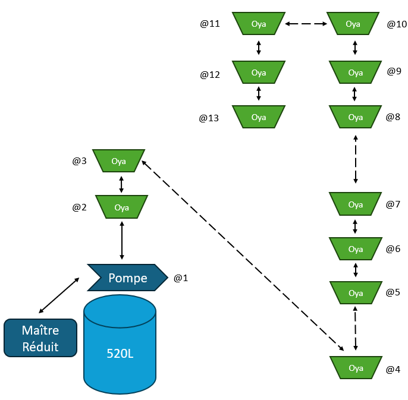
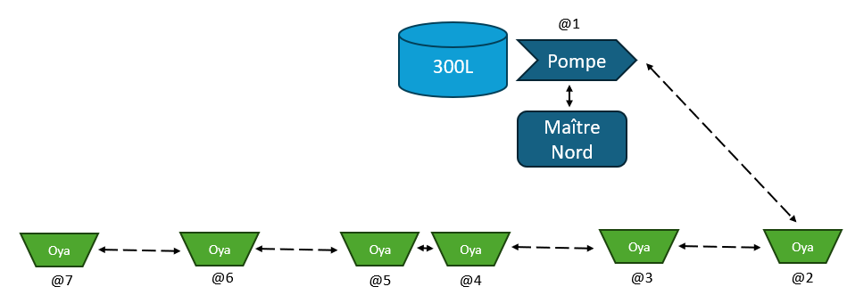

# Système de gestion des OYAs

## Présentation

Le but du système de remplissage automatique des OYAs est de pouvoir s'absenter pendant les vacances tout en laissant les OYAs se gérer tous seuls.

### Oyas

Les OYAs sont des sortes de pots en argile enterrés utilisés depuis des millénaires pour distribuer de l'eau à des cultures.

On remplit régulièrement ces pots. Grâce à leur porosité, l'eau se diffuse à travers l'OYAs au fur et à mesure où les racines des plantes assèchent la terre à proximité.

- Ils évitent les pertes d'eau par évaporation
- ne mouillent pas les feuilles des plantes
- ne mouille pas le sol en surface
- évitent le stress hydrique
- permettent de faire des économies d'eau

### Principe de fonctionnement

Des cuves récupèrent l'eau de pluie. A partir de ces cuves, un système comportant une pompe et plusieurs électrovannes permet de remplir les OYAs.

Le système rempli chaque OYA jusqu'au maximum ou bien selon le programme souhaité. La stratégie de remplissage est entièrement programmable.

## Description de nos réseaux d'OYAs

Notre installation comporte actuellement (en 2025) trois réseaux d'OYAs reliés chacun à une cuve et à son alimentation électrique autonome.

## Réseau A : Barbecue

C'est le plus ancien (mise en service en 2023). Il comporte à ce jour:

- 1 maître
- 1 pompe
- 7 OYAs
- 1 EV pour remplir un réservoir d'appoint

 Caractéristique | Description
-- | --
Nombre de nœuds | 10
Longueur | environ 30 m
Volume cuve | 520 L
Capacité totale des Oyas | 64 L (4x10 + 3x8 + cuve de 100L non gérée actuellement)
Alimentation | 1 Panneau solaire 120W + 2 Batteries 12V au plomb

La cuve et l'alimentation 12V déservent à la fois le système d'OYAs et un système de gestion de goutteurs alimenté par une petite pompe.

Ce réseau est à la fois composé de cartes électroniques  esclaves de "première génération" Rev Ax et de cartes récentes (Rev Gx produites en 2024).

Très bon retour sur le fonctionnement pendant l'été 2023. 
Excellent retour aussi en 2024.

A noter cependant la fragilité des électrovannes. Pour fonctionner correctement, il est nécessaire d'avoir une eau d'arrivée sans impureté. En effet, celle ci peut se déposer entre le corps et la membrane de l'électrovanne et bloquer cette dernière en position ouverte. Le tuyau 10mm transparent génère des algues qui sèchent pendant l'hiver lors de l'entreposage du système. Lors de la remise en service au printemps 2023, des morceaux d'algue de l'année précédente se sont détachées et sont venues perturber le fonctionnement des électrovannes.

## Réseau B : Réduit

- 1 maître
- 1 pompe
- 12 OYAs (dont 4 ajoutés en 2025)

Caractéristique | Description
-- | --
Nombre de nœuds | 13
Longueur | environ 35 m
Volume cuve | 520 L
Capacité totale des Oyas | 100 L (2x10 + 10x8) 
Alimentation | 1 Panneau solaire 120W + 2 Batteries 12V au plomb

Mis en service en 2024. Etendu en 2025.

## Réseau C : Nord (Derrière la maison)

- 1 maître
- 1 pompe
- 6 OYAs

Caractéristique | Description
-- | --
Nombre de nœuds | 7
Longueur | environ 15 m
Volume cuve | 150 L
Capacité totale des Oyas | 48 L (6x8) 
Alimentation | ? (A définir)

Mis en service en 2025.

## Pilotage par Wifi

Les deux maîtres des OYAs sont accessibles par Wifi.

On peut prendre le contrôle et consulter en temps réel le niveau d'eau dans chaque OYA.
On peut également paramétrer le fonctionnement du système (heures et stratégies de remplissages, ...).

Ci-dessous une capture d'un monitoring du 14/08/2024:

Durant nos vacances, les données sont également acheminées vers un cloud et mémorisées dans une base de données.
On peut ainsi voir évoluer les niveaux d'eau.

## Composants d'un réseau d'OYAs

### Réseau/Tuyau

Chaque système OYAs est composé d'un module maître et de plusieurs modules esclaves reliés entre eux par un réseau RS485 et un tuyau 12mm.

Le câble réseau comporte une alimentation 12V et les fils A et B du RS485.

Le réseau possède deux résistances de terminaison de 120 Ohms aux deux extrémités. Il est également polarisé côté maître par une pull up et une pull down de 220 Ohms (Valeur encore susceptible de bouger).

Pour trouver les bonnes valeurs et étant donné la mauvaise qualité de câble utilisé, il faut effectuer des mesures de signal au bout du bus et vérifier que les tensions au repos de A et de B sont conformes à la norme RS485. 

__NB:__ Le dispositif de la photo ci-dessus contient une résistance de 128 Ohm. On appelle ça un "bouchon" !! (d'où le bouchon de liège...)

## Modules électronique de pilotage

### Module Pompe

Le module pompe contient une carte esclave RS485 en configuration "pompe".

Connecteurs:
- connecteur 4 voies bus RS485 + alim
- connecteur pompe
- connecteur débitmètre

Ce module est placé en sortie de cuve pour pomper l'eau et donner une certaine pression dans le tuyau. La pompe est nécessaire pour assurer un débit constant quelque soit le niveau d'eau dans la cuve et quelle que soit la hauteur relative entre la cuve et les différents OYAs.

Il faut aussi noter qu'une pression minimale est nécessaire pour ouvrir une électrovanne (voir ces caractéristiques).

Le schéma et le pcb de la carte sont ici: [Carte esclave RS485](./slaves_rs485/hard)

Plusieurs versions ont été réalisées, compatibles entre-elles. A ce jour le système est composé de façon hétérogène par ces différentes versions.

Version | Date | Description
-- | -- | --
Rev Ax | 2023 | Version initiale avec modules (forme en L)
Rev Bx | 2023 | Correction RX/TX inversé
Rev Dx | 2024 | Version sans module (tout intégré en CMS)
Rev Ex | 2024 | Avec modules (petite carte)
Rev Gx | 2024 | MAX485 en CMS (petite carte)

Le logiciel est ici: [Logiciel esclave RS485](.\slaves_rs485\src)

### Module Oya

Le module OYA contient une carte esclave RS485 en configuration "OYA".

Connecteurs:
- connecteur 4 voies bus RS485 + alim
- connecteur électrovanne
- connecteur niveaux

Il contient également une électrovanne 12V et un capteur de niveau.

Ce module est placé sur chaque OYA.

Le capteur de niveau comporte deux flotteurs qui ferment un contact en position basse.

### Module Maître

Le maître des OYAs permet de commander une pompe et plusieurs électrovannes pour remplir des OYAs.

## Protocole réseau (RS485)

Le réseau est de type RS485. Il comporte un maître et plusieurs esclaves. Chaque esclave a une adresse unique (de 1 à 14 ou 1 à E en hexadécimal).

Seul le maître peut initier une communication. Un seul esclave peut répondre à une trame émise par le maître.

Types de messages du maître:

- Trame Commandes
- Trame Ping
- Trame Sync

Types de réponses d'un esclave:

- Trame Pompe
- Trame Oya
- Trame Pong

La communication se fait par cycles. Chaque cycle se termine par une trame Sync.

Durant un cycle, le maître envoie autant de trames __*"Commandes"*__ qu'il y'a d'esclaves configurés. Chaque trame __*"Commandes"*__ comporte un appel destiné à un esclave en particulier. Seul l'esclave appelé peut répondre avec l'une des deux trames __*"Oya"*__ ou __*"Pompe"*__.

Après un __*"Sync"*__, le maître doit impérativement attendre un temps minimum avant d'initier un nouveau cycle. Cela permet aux esclaves d'effectuer des traitements.

Pour plus de détails, voir 

